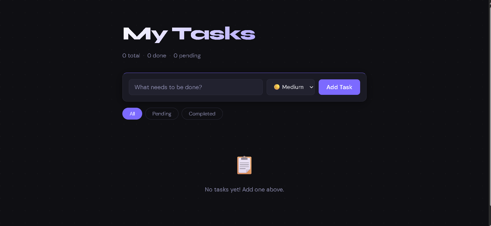
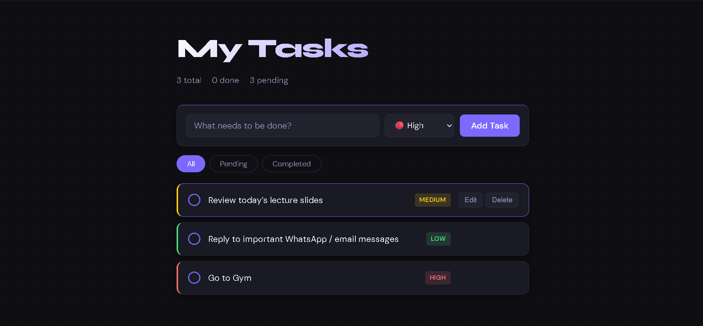

# 📝 Todo App — Full Stack Java Spring Boot

A clean, interactive full-stack To-Do List application built with **Spring Boot** (backend) and **HTML/CSS/JavaScript** (frontend). This was my first full-stack project!

---

## 📸 Screenshots

### App Overview



### Tasks in Action



---

## 🚀 Features

- ✅ Add tasks with a title and priority level (Low, Medium, High)
- ✅ Mark tasks as complete / incomplete
- ✅ Edit existing tasks
- ✅ Delete tasks
- ✅ Filter tasks by: All / Pending / Completed
- ✅ Live stats bar (total, done, pending count)
- ✅ Fully persistent data via H2 in-memory database
- ✅ REST API backend with Spring Boot

---

## 🛠️ Tech Stack

| Layer | Technology |

|---|---|

| Frontend | HTML5, CSS3, Vanilla JavaScript |

| Backend | Java 17, Spring Boot 3 |

| Database | H2 (in-memory) |

| Build Tool | Maven |

| Version Control | Git & GitHub |

---

## 📁 Project Structure

```

todo-app/

├── src/

│   └── main/

│       ├── java/com/todo/todo_app/

│       │   ├── TodoAppApplication.java    ← App entry point

│       │   ├── controller/

│       │   │   └── TodoController.java    ← REST API endpoints

│       │   ├── model/

│       │   │   └── Todo.java              ← Data model / entity

│       │   ├── repository/

│       │   │   └── TodoRepository.java    ← Database layer

│       │   └── service/

│       │       └── TodoService.java       ← Business logic

│       └── resources/

│           ├── static/

│           │   ├── index.html             ← Frontend UI

│           │   ├── style.css              ← Styling

│           │   └── app.js                 ← Frontend logic

│           └── application.properties     ← App configuration

└── pom.xml                                ← Maven dependencies

```

---

## ⚙️ How to Run Locally

### Prerequisites

- Java 17 or higher installed
- VS Code with Java + Spring Boot extensions
- Git installed

### Steps

**1. Clone the repository**

**2. Run the Spring Boot app**

./mvnw spring-boot:run

**3. Open in browser**

```

http://localhost:8080

```

---

## 📚 What I Learned

- How to build a **REST API** with Spring Boot
- How **Spring layers** work: Controller → Service → Repository
- How **JPA / Hibernate** maps Java classes to database tables
- How the **frontend communicates** with the backend using `fetch()`
- How to use **Git and GitHub** for version control

---

## 🔮 Future Improvements

- [ ] Add user authentication (login/signup)
- [ ] Add due dates for tasks
- [ ] Switch from H2 to PostgreSQL for persistent storage
- [ ] Deploy to the cloud (Railway / Render)
- [ ] Add drag-and-drop task reordering


## 👤 Author

**Ahmed Akhtar**

GitHub: [@AhmedAkhtar-07](https://github.com/AhmedAkhtar-07)

---
